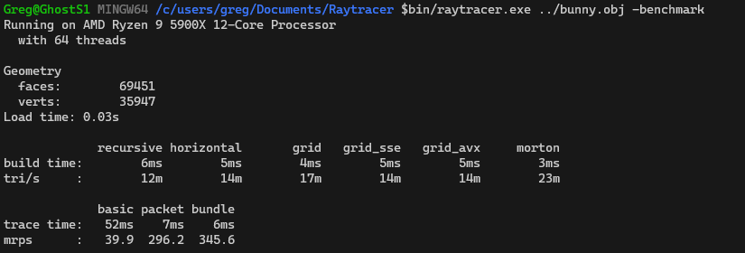

# Sequoia
This project is a collection of CPU hierarchy builders and ray traversers.

# Building
The recommended build environment is `msys2` with `g++` on Windows. Linux builds should work but are untested.

The project uses a makefile so to build simply type `make` from the root.

# Running

After building, the executable is located at `bin/raytracer`. Run with no arguments to see the build options.

## Arguments

The first argument should be a path to an `obj` file. 

## Ouput

Some timing info about the run will be displayed in standard out. A heatmap will also be created in the base directory:

# Performance

The executable can be run in benchmark mode to compare build and traverse speeds of a given scene. The rays are primary rays only for a 1080p frame.

As can be seen, both build and trace performance are realtime for simple (69k bunny) geometry.

